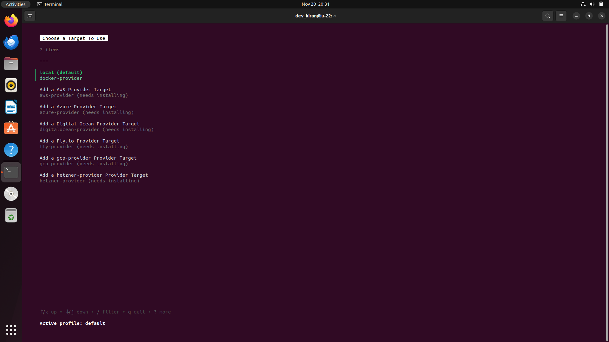
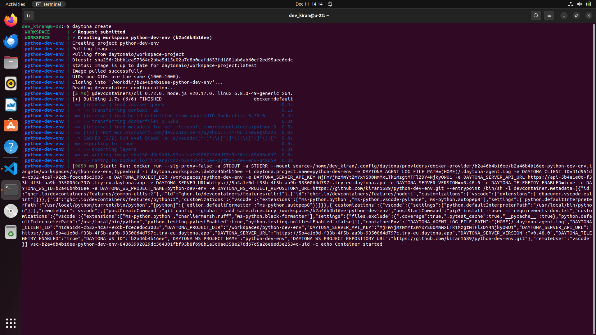

# Setting Up a Python Dev Environment with Dev Containers and Daytona

## Introduction

In modern Python development, managing dependencies, Python versions,
and conflicting libraries can often be cumbersome and time-consuming. 
Traditional tools like venv, virtualenv, and pipenv have helped manage 
these issues, but there's a better way to simplify and streamline your 
workflow using Dev Containers with Daytona.

This guide walks you through setting up a Python development environment
using Daytona's containerized workspaces and the Dev Container.

### TL;DR

- Required tools and knowledge for hands-on learning.
- Overview of both Dev Containers and Daytona.
- Setting up a Python project template.
- Creating a Python project workspace in Daytona.
- Conclusion

## Prerequisites

To follow this guide, you'll need to have the following:
- Basic understanding of [Python](definitions/20240820_defintion_python.md) 
  and [Development Environment](definitions/20240819_definition_development environment.md)
- An IDE (like [VS Code](https://code.visualstudio.com/))
- Docker (download from [here](https://www.docker.com/))
- Daytona latest version [install from [here](https://www.daytona.io/docs/installation/installation/)]

## Overview of Daytona

Daytona is an open-source development environment manager that uses configuration
files from a project's repository to build and provision workspaces. It simplifies
the process of setting up consistent development environments across teams or for 
individual developers.

**Key Features of Daytona:**

- **Containerized Environments**: Keep your laptop clean by using clearly separated and containerized dev environments.
- **Portability**: Move your environments with you or host them on a remote server.
- **Consistency**: Ensure all team members work in identical environments, eliminating "it works on my machine" issues.
- **Easy Setup**: Create a fully configured development environment with a single command.
- **IDE Integration**: Seamlessly works with popular IDEs like VS Code and JetBrains products.
- **Git Provider Integration**: Easily connect with GitHub, GitLab, Bitbucket, and more for smooth workflow integration.
- **GPU Support**: Leverage GPU acceleration directly within your Daytona workspaces, ideal for machine learning and data science projects.

For more info about Daytona and it's features, check [here](https://daytona.io)

## Overview of Dev Containers

Dev Containers, short for Development Containers, are a way to configure portable 
and reproducible development environments using Docker containers. Dev containers 
are isolated, lightweight environments that allow developers to work inside a 
containerized version of a build environment. 

**Key Features of Dev Containers:**

- **Pre-configured Build Environments**: Dev containers come with a base image that has all the software, tools, and dependencies pre-installed, so you can get started coding right away.
- **Isolated Environments**: Each dev container has its own isolated filesystem, networking, memory, and CPU, so there are no conflicts with other projects or software on your local machine.
- **Reproducible Builds**: Dev containers provide the exact same environment every time they're launched, ensuring consistent build results. No more "it works on my machine!" issues.
- **Less Setup Time**: Starting a new project with dev containers means you can skip the lengthy setup and configuration process. Just open your project in the container and everything is ready to go.
- **Flexibility**: You can choose a base image with the software and tools you want or build your own custom base image, meeting your specific needs.

For more info about Dev Containers and it's features, check [here](https://containers.dev/)

## Step 1: Preparations

### Fork the Template Repository

We’ll use this [pthon-project-template](https://github.com/pamelafox/python-project-template), 
which includes a basic `main.py` and tests in `tests/main_test.py`. Refer to the `README` for 
details on the project structure.

Click on the "Fork" button at the top right of the repository page to create a local copy 
under your GitHub account.

The `.devcontainer/devcontainer.json` file content defines a configuration for a python 
development container environment.

```json
{
    "name": "Python 3",
    "image": "mcr.microsoft.com/devcontainers/python:3.11-bullseye",
    "customizations": {
        "vscode": {
            "settings": {
                "python.defaultInterpreterPath": "/usr/local/bin/python",
                "python.testing.pytestEnabled": true,
                "python.testing.unittestEnabled": false,
                "files.exclude": {
                    ".coverage": true,
                    ".pytest_cache": true,
                    "__pycache__": true
                }
            },
            "extensions": [
                "ms-python.python",
                "charliermarsh.ruff",
                "ms-python.black-formatter"
            ]
        }
    },

    // "forwardPorts": [],

	"postCreateCommand": "git config --global --add safe.directory ${containerWorkspaceFolder}",

	"postStartCommand": "pip3 install --user -r requirements-dev.txt && pre-commit install",

  "remoteUser": "vscode"
}
```

Let's breakdown the `devcontainer.json` file 

- **name**: Specifies the name of the development environment.
- **image**: Points to the Docker image used for the container, `mcr.microsoft.com/devcontainers/python:3.11-bullseye`, a Python 3.11 environment based on Debian Bullseye.
- **customizations**: Allows customization of the development environment, specifically for Visual Studio Code.
  - **vscode**: AContains VS Code-specific configurations
    - **settings**: Defines default VS Code settings for the container:
      - **python.defaultInterpreterPath**: Specifies the Python interpreter path inside the container (`/usr/local/bin/python`).
      - **python.testing.pytestEnabled**: Enables the use of `pytest` for testing.
      - **python.testing.unittestEnabled**: Disables unittest as the testing framework.
      - **files.exclude**: Hides specified files and folders (e.g., `.coverage`, `.pytest_cache`, `__pycache__`) from the VS Code file explorer.
    - **extensions**: Lists extensions to be installed automatically in the container:
      - **ms-python.python**: Python language support for VS Code.
      - **charliermarsh.ruff**: A Python linter.
      - **ms-python.black-formatter**: Formatter for Python code using Black.
- **forwardPorts**: (Currently commented out) Would be used to expose specific container ports to the host machine for interaction.
- **postCreateCommand**: Configures Git to recognize the container workspace folder as safe (`git config --global --add safe.directory ${containerWorkspaceFolder}`).
- **postStartCommand**: Installs Python packages from requirements-dev.txt (`pip3 install --user -r requirements-dev.txt`) and sets up pre-commit hooks (`pre-commit install`).
- **remoteUser**: sets `vscode` as the non-root default user.

By including a devcontainer.json file in your project repository, you can specify not just 
the Python version and dependencies, but also any required system packages, VS Code extensions, 
environment variables, and even custom scripts to run during setup.

## Step 2: Main Process

### Step 2.1: Start Daytona Server

Start the daytona server by running the command

```bash
daytona server
```

Your output should be similar to the screenshot below.


Choose "yes" and you should see a similar output in the screenshot below.


### Step 2.2: Add Git Provider

Daytona integrates with your preferred Git provider, streamlining your workflow 
by allowing direct access to repositories, and simplifying workspace creation 
from existing projects.

Execute the command provided below to add your git provider. Daytona also has 
support for other git providers like Bitbucker and Gitlab. You can learn more 
about Daytona Git Providers [here](https://www.daytona.io/docs/configuration/git-providers/)

```bash
daytona git-provider add
```

Your output should be similar to the image below
    

    
Select GitHub and provide your personal access token.


### Step 2.3: Choose your preferred IDE
     
Run this command in terminal to choose your [IDE](https://www.daytona.io/docs/usage/ide/).

```bash
daytona ide
```

	

### Step 2.4 Create a Daytona Workspace 

Now create a dev environment of the repository you created in GitHub(by forking) and 
follow the prompts after you run it.

```bash
daytona create
```

Choose Github as provider and select the python-project-template repository.

#### Step 2.4.1 Provide workspace name

The name of the workspace is usually the repository name if you didn't modify it when 
prompted in the creation of the workspace. In my case, it's `python-project-template`


#### Step 2.4.2 Choose the target 

Now it will ask you to choose the target, select `local` and enter.



Daytona will now start creating a workspace by pulling your project and install all 
required dependencies, once done it will open your project in your default IDE.




Now, your python dev environmentis ready to use.

### Step 3: Confirmation

In your VS Code, run the test cases using the command below, you will see all the testcases passed. 
This means the python dev environment has successfull set for your project.

```bash
python3 -m pytest
```


## Conclusion

By following this guide, you've set up a fully containerized Python development environment using 
Daytona and Dev Containers. This setup ensures that your projects are reproducible, isolated, and 
consistent across machines, enabling smooth collaboration and effortless debugging.

## References

- [Python Project Template by Pamela Fox](https://github.com/pamelafox/python-project-template)

- [Daytona Documentation](https://www.daytona.io/dotfiles/the-ultimate-guide-to-managing-python-environments)
