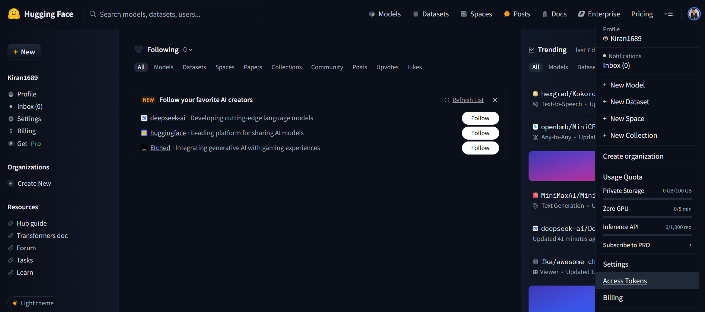
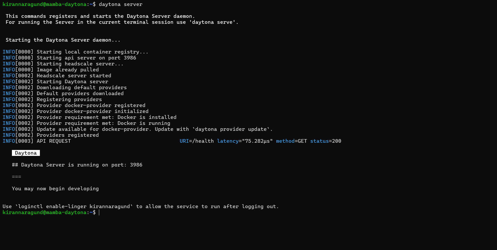
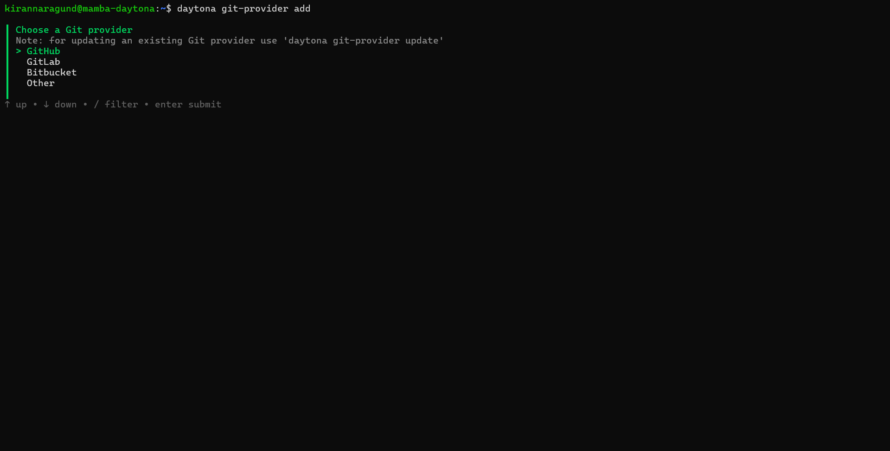
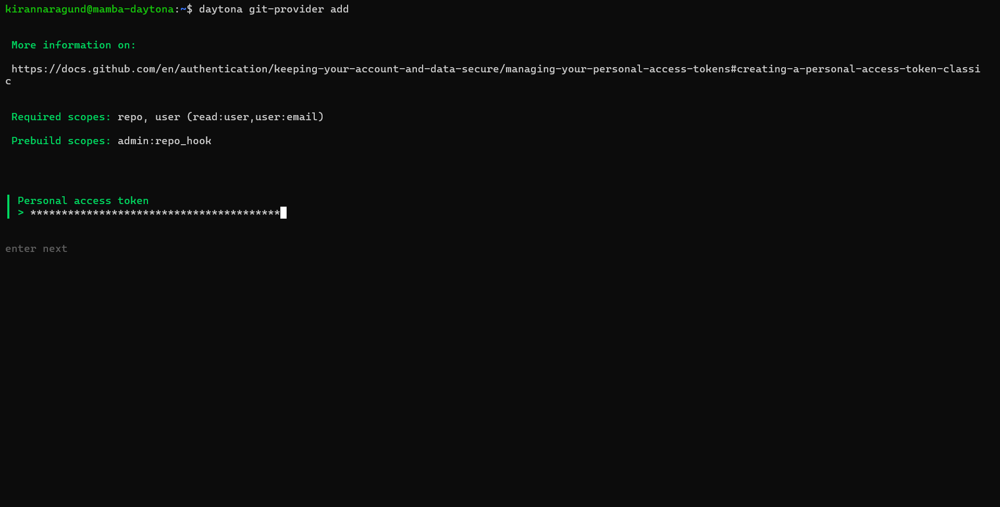
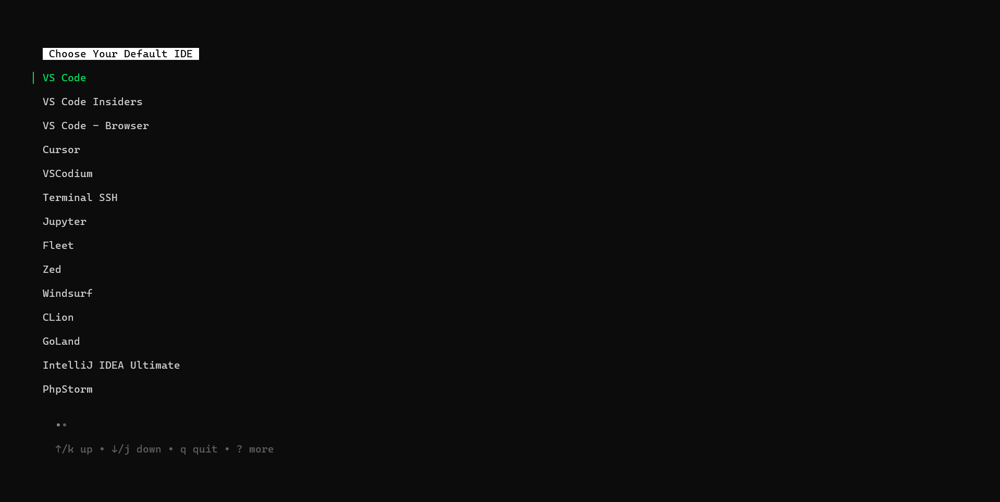
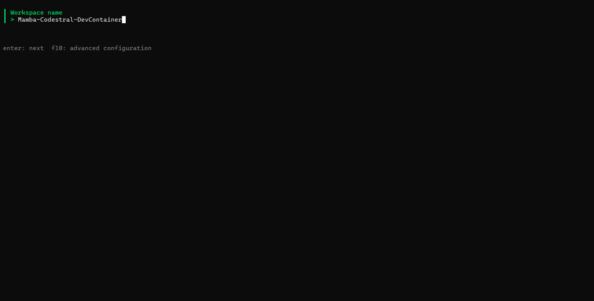
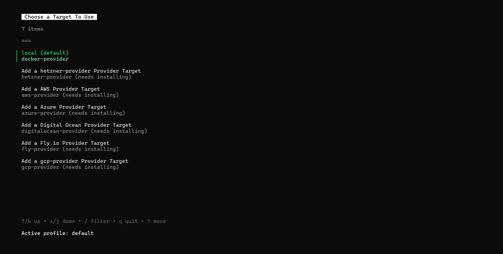
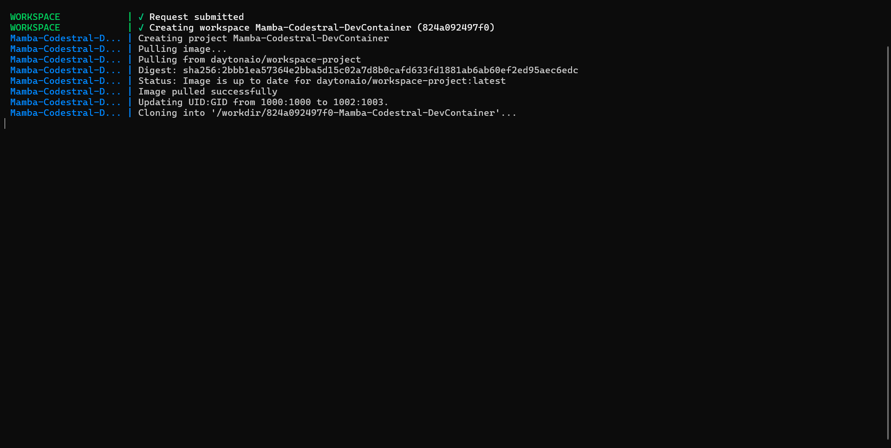
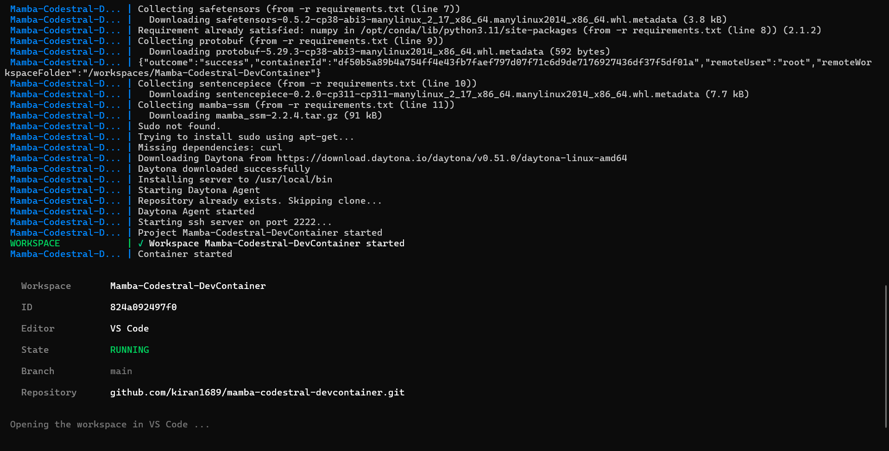

# Run GPU supported LLM inside container with devcontainer

# Introduction

The world of AI and large language models ([LLMs](../definitions/20241219_definition_llm.md)) is expanding rapidly,
and integrating these cutting-edge tools into your development environment
can unlock countless possibilities. 

This guide will walk you through how to set up and run the Mamba-Codestral-7B-v0.1 model,
hosted on [Hugging Face](https://huggingface.co/mistralai/Mamba-Codestral-7B-v0.1), within a container with [devcontainer](../definitions/20240819_definition_development%20container.md).

## Overview of Mamba-Codestral-7B

Mamba-Codestral-7B-v0.1 is a powerful 7-billion parameter large language model ([LLM](../definitions/20241219_definition_llm.md)) 
designed to handle a wide range of natural language processing and code-related tasks.
Developed with a focus on efficiency and versatility, the model strikes a balance between
high performance and accessibility, making it an excellent choice for developers looking
to integrate LLM capabilities into their projects.

**Here are the key features of Mamba-Codestral-7B:**

- **Versatile Language Model:** Excels in natural language understanding and code-related tasks like generation and debugging.

- **GPU Supported**: Designed to leverage modern GPUs for faster inference, enabling efficient local or cloud-based deployment.

- **Lightweight and Efficient:** Optimized for fast performance on GPUs and resource-efficient setups.

- **Local Development Friendly:** Runs offline, ensuring privacy and flexibility for developers.

- **Hugging Face Integration:** Seamless setup and support from an active developer community.

**Key Use Cases:**

- **Code generation:** Generate boilerplate code or snippets based on natural language prompts.

- **Code debugging:** Identify and suggest fixes for errors in source code.

- **Documentation assistance:** Create detailed comments and explanations for code.

## Step 1: Preparations

To run the Mamba-Codestral-7B-v0.1 model inside a containerized development environment,
you need to prepare your tools and resources before setting up the devcontainer.

### Step 1.1: Create a Hugging Face Token

You need to create a Hugging Face Token to access or download the model, follow the steps below to create.

- **Step 1.1.1**: Sign Up or Log In to Hugging Face

  - Go to [Hugging Face's website](https://huggingface.co/).

  - If you don’t already have an account, sign up for free.

- **Step 1.1.2**: Generate an Access Token
  
  - Navigate to your profile by clicking on your avatar in the top-right corner.

  - Click on Access Tokens.

  

  - Provide a token name and Choose the **Read** role (this is sufficient to download models).

  

  - Click Generate Token.

- **Step 1.1.3**: Save the Token
  
  - Copy the token and save it securely. You’ll use it later when accessing the model.

### Step 1.2: Install NVIDIA GPU Toolkit

You'll need the NVIDIA Container Toolkit to allow Docker to utilize GPU acceleration. 
Follow the below steps to install the NVIDIA Container Toolkit.

- **Step 1.2.1**: NVIDIA Drivers
  
  - Ensure the NVIDIA GPU drivers are installed on your host machine by running the below command

  ```bash
  nvidia-smi
  ```

  This should display information about your GPU.

  If you do not have drivers installed, check out [here](https://www.nvidia.com/en-us/drivers/) to install depending on your Operating System and GPU.

- **Step 1.2.2**: Configure the production repository to install NVIDIA Container Toolkit

  - Run the below commands on your Linux machine

  ```bash
  curl -fsSL https://nvidia.github.io/libnvidia-container/gpgkey | sudo gpg --dearmor -o /usr/share/keyrings/nvidia-container-toolkit-keyring.gpg \
  && curl -s -L https://nvidia.github.io/libnvidia-container/stable/deb/nvidia-container-toolkit.list | \
    sed 's#deb https://#deb [signed-by=/usr/share/keyrings/nvidia-container-toolkit-keyring.gpg] https://#g' | \
    sudo tee /etc/apt/sources.list.d/nvidia-container-toolkit.list
  ```

- **Step 1.2.3**: Update the packages list from the repository

  ```bash
  sudo apt-get update
  ```

- **Step 1.2.4**: Install the NVIDIA Container Toolkit packages

  ```bash
  sudo apt-get install -y nvidia-container-toolkit
  sudo systemctl restart docker
  ```

- **Step 1.2.5**: Verify installation
  
  ```bash
  docker run --rm --gpus all nvidia/cuda:12.6.0-base-ubuntu24.04 nvidia-smi
  ```

  

  If your setup is correct, the `nvidia-smi` command will display information about your GPU,
  confirming that the GPU is accessible inside Docker containers.

## Step 2: Setting Up the Dev container and project repository

Now, we're going to create a dev container using a **devcontainer.json** configuration file also, 
writing several [Python](../definitions/20240820_defintion_python.md) scripts and required files.

- **Step 2.1**: Create a new directory

Create a directory with any name of your choice and move into the directory.

```bash
mkdir Mamba-Codestral-DevContainer && cd Mamba-Codestral-DevContainer
```

- **Step 2.2**: Create a `.devcontainer` directory

This is where your devcontainer.json file will live.

```bash
mkdir .devcontainer && cd .devcontainer
```

- **Step 2.3**: create a `devcontainer.json` file:

You are going to create a `devcontainer.json` file with the following code. This is the configuration file for the python environment specifying settings and dependencies.

```json
  {
    "name": "Mamba-Codestral Environment",
    "image": "pytorch/pytorch:2.5.1-cuda12.4-cudnn9-devel",
    "runArgs": [
        "--gpus",
        "all"
    ],
    "hostRequirements": {
        "gpu": "true"
    },
    "features": {
        "ghcr.io/devcontainers/features/git:1": {}
    },
    "customizations": {
        "vscode": {
            "extensions": [
                "ms-python.python",
                "ms-python.vscode-pylance",
                "ms-vscode-remote.remote-containers",
                "nvidia.nsight-vscode-edition"
            ]
        }
    },
    "postCreateCommand": "pip install -r requirements.txt"
  }
```
Let's break down the `devcontainer.json` file.

- **name**: Specifies the name of the development environment.
- **image**: Specifies the base Docker image with `PyTorch` and `CUDA` pre-installed.
- **runArgs**: Enables GPU access for the container with Docker arguments.
- **hostRequirements**: Ensures the host system has a GPU to run the container.
- **features**: Installs Git within the container for version control.
- **customizations.vscode.extensions**: Adds necessary VS Code extensions for Python, containers, and NVIDIA debugging..
- **postCreateCommand**: Installs Python dependencies from `requirements.txt` after the container builds.

By including a `devcontainer.json` file in your project repository, you can specify not just
the Python version and dependencies, but also any required system packages, VS Code extensions,
environment variables, and even custom scripts to run during setup.
 
- **Step 2.4**: Add the Script `download_model.py`

Now we will create a script to download the Mamba-Codestral-7B-v0.1 model from Hugging Face.

```python
from huggingface_hub import snapshot_download
from pathlib import Path

# Place you Hugging Face Access Token here
hf_token = "your hf access token"

# Define the model repository and storage path
REPO_ID = "mistralai/Mamba-Codestral-7B-v0.1"
DIR = Path.home().joinpath("mistral_models", "Mamba-Codestral-7B-v0.1")

# Ensure the directory exists
DIR.mkdir(parents=True, exist_ok=True)

# Download specific files from the model repository
print(f"Downloading model files from {REPO_ID}...")
snapshot_download(
    repo_id=REPO_ID,
    allow_patterns=["*"],
    local_dir=DIR,
    token=hf_token  # Authenticate with Hugging Face
)

print(f"Model downloaded successfully")
```

This script uses the Hugging Face `snapshot_download` method to download the `Mamba-Codestral-7B-v0.1` model files.
It authenticates using a Hugging Face `access token`(make sure to replace with your token) and saves the model files
in a specified directory (`mistral_models`) The script ensures the directory exists, downloads all files from the model repository,
and provides status messages to confirm the download process.

- **Step 2.5**: Add the Script `generate_text.py`

Now we will create a script to generate the text from Mamba-Codestral-7B-v0.1 model.

```python
from transformers import AutoTokenizer, AutoModelForCausalLM
import torch
from pathlib import Path

# Define the model path
MODEL_PATH = str(Path.home().joinpath("mistral_models", "Mamba-Codestral-7B-v0.1"))

# Check if GPU is available
device = torch.device("cuda" if torch.cuda.is_available() else "cpu")
if device.type == "cuda":
    print(f"Using GPU: {torch.cuda.get_device_name(0)}")
else:
    print("No GPU found. Using CPU, which may be slower.")

# Load the tokenizer and model
print("Loading the tokenizer and model...")
tokenizer = AutoTokenizer.from_pretrained(MODEL_PATH)
model = AutoModelForCausalLM.from_pretrained(
    MODEL_PATH,
    load_in_4bit=True,
    device_map="auto",
    torch_dtype=torch.float16,
    bnb_4bit_compute_dtype=torch.float16
)

print("Model loaded successfully!")

# Function to generate text with customizable parameters
def generate_custom_text(prompt: str, max_length=100, temperature=0.7, top_p=0.9):
    inputs = tokenizer(prompt, return_tensors="pt").to(device)

    # Ensure attention mask is set explicitly if the pad_token is same as eos_token
    attention_mask = inputs.get('attention_mask', None)
    if attention_mask is None:
        attention_mask = torch.ones_like(inputs['input_ids'], device=device)

    with torch.no_grad():
        outputs = model.generate(
            inputs["input_ids"],
            attention_mask=attention_mask,
            max_length=max_length,
            temperature=temperature,
            top_p=top_p,
            do_sample=True,
            pad_token_id=tokenizer.eos_token_id
        )
    return tokenizer.decode(outputs[0], skip_special_tokens=True)

prompt = "The future of artificial intelligence"
generated_text = generate_custom_text(prompt)
print("Generated text: ", generated_text)
```

- **Step 2.6**: Add the Script `generate_code.py`

Now we will create a script to generate the code from Mamba-Codestral-7B-v0.1 model.

```python
from transformers import AutoTokenizer, AutoModelForCausalLM
import torch
from pathlib import Path

# Define the model path
MODEL_PATH = str(Path.home().joinpath("mistral_models", "Mamba-Codestral-7B-v0.1"))

# Check if GPU is available
device = torch.device("cuda" if torch.cuda.is_available() else "cpu")
if device.type == "cuda":
    print(f"Using GPU: {torch.cuda.get_device_name(0)}")
else:
    print("No GPU found. Using CPU, which may be slower.")

# Load the tokenizer and model
print("Loading the tokenizer and model...")
tokenizer = AutoTokenizer.from_pretrained(MODEL_PATH)
model = AutoModelForCausalLM.from_pretrained(
    MODEL_PATH,
    load_in_4bit=True,
    device_map="auto",
    torch_dtype=torch.float16,
    bnb_4bit_compute_dtype=torch.float16
)

print("Model loaded successfully!")

# Function to generate code based on a prompt
def generate_code(prompt: str, max_length=150, temperature=0.7, top_p=0.9):
    inputs = tokenizer(prompt, return_tensors="pt").to(device)

    # Ensure attention mask is set explicitly if the pad_token is same as eos_token
    attention_mask = inputs.get('attention_mask', None)
    if attention_mask is None:
        attention_mask = torch.ones_like(inputs['input_ids'], device=device)

    with torch.no_grad():
        outputs = model.generate(
            inputs["input_ids"],
            attention_mask=attention_mask,
            max_length=max_length,
            temperature=temperature,
            top_p=top_p,
            do_sample=True,
            pad_token_id=tokenizer.eos_token_id
        )
    return tokenizer.decode(outputs[0], skip_special_tokens=True)

prompt = "Write a Python function that calculates the factorial of a number using recursion."
generated_code = generate_code(prompt)
print("Generated Code:\n", generated_code)
```

- **Step 2.7**: Add the Script `bug_finder.py`

Now we will create a script to find the bugs in the code from Mamba-Codestral-7B-v0.1 model.

```python
from transformers import AutoTokenizer, AutoModelForCausalLM
import torch
from pathlib import Path

# Define the model path
MODEL_PATH = str(Path.home().joinpath("mistral_models", "Mamba-Codestral-7B-v0.1"))

# Check if GPU is available
device = torch.device("cuda" if torch.cuda.is_available() else "cpu")
if device.type == "cuda":
    print(f"Using GPU: {torch.cuda.get_device_name(0)}")
else:
    print("No GPU found. Using CPU, which may be slower.")

# Load the tokenizer and model
print("Loading the tokenizer and model...")
tokenizer = AutoTokenizer.from_pretrained(MODEL_PATH)
model = AutoModelForCausalLM.from_pretrained(
    MODEL_PATH,
    load_in_4bit=True,
    device_map="auto",
    torch_dtype=torch.float16,
    bnb_4bit_compute_dtype=torch.float16
)

print("Model loaded successfully!")

# Function to detect and suggest fixes for bugs in the code
def bug_finder_in_code(code_snippet: str, max_length=300):
    prompt = f"Identify any bugs in the following code and suggest possible fixes:\n\n{code_snippet}\n\nBug fixes and explanations:"
    inputs = tokenizer(prompt, return_tensors="pt").to(device)

    # Ensure attention mask is set explicitly if the pad_token is same as eos_token
    attention_mask = inputs.get('attention_mask', None)
    if attention_mask is None:
        attention_mask = torch.ones_like(inputs['input_ids'], device=device)
    
    with torch.no_grad():
        outputs = model.generate(
            inputs["input_ids"],
            attention_mask=attention_mask,
            max_length=max_length,
            temperature=0.7,
            top_p=0.9,
            do_sample=True,
            pad_token_id=tokenizer.eos_token_id
        )
    
    bug_fix_suggestions = tokenizer.decode(outputs[0], skip_special_tokens=True)
    return bug_fix_suggestions

code_snippet = '''
def calculate_sum(a, b):
    return a + b

result = calculate_sum(5)
print(result)
'''

bug_fixes = bug_finder_in_code(code_snippet)
print("Bug Fix Suggestions: ", bug_fixes)
```

You can update the prompts of your choice and can also create a new custom scripts.

- **Step 2.8**: Create a `requirements.txt` file

Add a requirements.txt file to specify development dependencies. Include the following content:
```
torch
huggingface_hub
transformers
bitsandbytes
accelerate
nvidia-pyindex
safetensors
numpy
protobuf
sentencepiece
mamba-ssm 
causal-conv1d
```

- **Step 2.9**: Initialize, Commit, and Create a GitHub repository

Now initialize git and commit all the changes you made to your directory.

```bash
git init
git add .
git commit -m "inital commit"
```

After committing your code you will push it to a remote repository of your choice.

```bash
git remote add origin https://github.com/YOUR-GITHUB-USERNAME/YOUR-DIRECTORY-NAME.git
git branch -M main
git push -u origin main
```

You can check out my repository [here](https://github.com/Kiran1689/Mamba-Codestral-DevContainer).

## Running LLM in Daytona with dev container

Here you are going to use Daytona to run LLM, using GitHub as a Provider, and 
open a workspace in VS Code. You should ensure `daytona` is installed on your machine before proceeding.

### Step 1: Start Daytona Server

Start the daytona server by running the command.

```bash
daytona server
```

Your output should be similar to the screenshot below.


Choose "yes" and you should see a similar output in the screenshot below.


### Step 2: Add Git Provider

Daytona integrates with your preferred Git provider, streamlining your workflow
by allowing direct access to repositories, and simplifying workspace creation
from existing projects.

Execute the command provided below to add your git provider. Daytona also has
support for other Git providers like Bitbucket and GitLab. You can learn more
about Daytona Git Providers [here](https://www.daytona.io/docs/configuration/git-providers/)

```bash
daytona git-provider add
```

Your output should be similar to the image below.



Select GitHub and provide your personal access token.



### Step 3: Choose your preferred IDE

Run this command in the terminal to choose your [IDE](https://www.daytona.io/docs/usage/ide/).

```bash
daytona ide
```



### Step 4: Create a Daytona Workspace

Now create a dev environment of the repository you created in GitHub and
follow the prompts after you run it.

```bash
daytona create
```

Choose GitHub as a provider and select the `Mamba-Codestral-DevContainer` repository.

#### Step 4.1: Provide workspace name

The name of the workspace is usually the repository name if you didn't modify it when
prompted in the creation of the workspace.



#### Step 4.2: Choose the target

Now it will ask you to choose the target, select `local`, and enter.



Daytona will now start creating a workspace by pulling your project and installing all
required dependencies, once done it will open your project in your default IDE.





Now, you are ready to run the LLM within your dev container.

### Confirmation

Test the setup by running the LLM model in your VS Code:

```bash
python download_model.py
```
This will take a few minutes to download the model.


Now run the python scripts you created earlier one by one and note that outputs may be different in your case.

```bash
python generate_text.py
```


```bash
python generate_code.py
```


```bash
python generate_code.py
```


## Conclusion

You've successfully set up a fully containerized development environment for running Mamba-Codestral-7B-v0.1 inside Daytona.
This workflow ensures consistency, simplicity, and efficiency in managing Python-based AI projects.

## References

- [Daytona Documentation](https://www.daytona.io/docs/)

- [GitHub Repository](https://github.com/Kiran1689/Mamba-Codestral-DevContainer)

- [Hugging Face Official Site](https://huggingface.co/mistralai/Mamba-Codestral-7B-v0.1)

